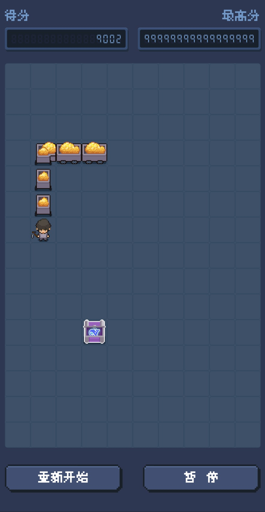
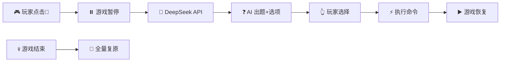

# 🐍 跨设备"穿墙"贪吃蛇：HarmonyOS分布式游戏技术实践

> **"什么？蛇撞墙没死，还跑到另一台设备上了？"**  
> 这不是Bug，这是Feature！这是一次对传统游戏边界的技术突破。

## 🚀 项目亮点

当蛇头撞到屏幕边界时，它没有死亡，而是神奇地"穿越"到了另一台设备上继续游戏！这是一个基于HarmonyOS分布式能力开发的创新贪吃蛇游戏，展示了跨设备无缝游戏体验的技术可能性。

> **想象一个场景**：你在手机上玩贪吃蛇，当蛇撞击右边界时，游戏无缝切换到旁边的平板上，蛇从左边界进入继续游戏...这就是HarmonyOS分布式技术的魅力所在。


*▲ 跨设备边界穿越演示*

**核心特色：**
- 🌐 **跨设备边界穿越**：蛇撞击边界后自动跳转到附近设备  
- 🔄 **实时状态同步**：分数、蛇身、食物位置完美保持
- ⚡ **零感知切换**：流畅如丝的设备间迁移体验
- 🤖 **DeepSeek AI 管理员**：AI 实时分析对局，问答式动态调参（新增）
- 🛡️ **临时授权机制**：管理员权限会话级，对局结束全量复原（新增）
- 🎯 **智能设备发现**：基于HarmonyOS分布式软总线自动发现
- 📱 **异构屏幕适配**：手机、平板、智慧屏完美适配

## 🏗️ 技术架构

```
┌─────────────────┐    ┌─────────────────┐    ┌─────────────────┐
│   设备A(手机)    │    │   设备B(平板)    │    │  设备C(智慧屏)   │
├─────────────────┤    ├─────────────────┤    ├─────────────────┤
│  HTML5 游戏层    │    │  HTML5 游戏层    │    │  HTML5 游戏层    │
│  ┌─────────────┐│    │  ┌─────────────┐│    │  ┌─────────────┐│
│  │ Canvas渲染  ││    │  │ Canvas渲染  ││    │  │ Canvas渲染  ││
│  │ 游戏逻辑    ││    │  │ 游戏逻辑    ││    │  │ 游戏逻辑    ││
│  └─────────────┘│    │  └─────────────┘│    │  └─────────────┘│
├─────────────────┤    ├─────────────────┤    ├─────────────────┤
│    JSBridge     │    │    JSBridge     │    │    JSBridge     │
├─────────────────┤    ├─────────────────┤    ├─────────────────┤
│ HarmonyOS原生层  │    │ HarmonyOS原生层  │    │ HarmonyOS原生层  │
│ • 分布式数据对象 │    │ • 分布式数据对象 │    │ • 分布式数据对象 │
│ • 应用接续能力   │    │ • 应用接续能力   │    │ • 应用接续能力   │
└─────────────────┘    └─────────────────┘    └─────────────────┘
          │                       │                       │
          └───────────────────────┼───────────────────────┘
                                  │
                    ┌─────────────────────────┐
                    │    分布式软总线(DSoftBus)  │
                    │  • WiFi Direct连接      │
                    │  • 低延迟数据传输(<20ms) │
                    │  • 自动设备发现         │
                    └─────────────────────────┘
```

### 🤔 为什么选择这种架构？
- **HTML5**：快速迭代游戏逻辑，跨平台兼容性好
- **HarmonyOS原生**：提供强大的分布式能力支撑
- **JSBridge**：实现Web与Native间高效双向通信
- **分布式软总线**：无需互联网的设备间直连通道

## 💡 核心技术实现

### 🎯 边界穿越核心算法

```javascript
// 精确边界碰撞检测
function checkBoundaryCollision(head) {
  let boundaryCollision = null;
  
  if (head.x < 0) boundaryCollision = 'left';
  else if (head.x >= tileCountX) boundaryCollision = 'right';
  else if (head.y < 0) boundaryCollision = 'top';
  else if (head.y >= tileCountY) boundaryCollision = 'bottom';

  if (boundaryCollision) {
    // 触发跨设备穿越机制
    const gameState = {
      snake: snake,
      food: food,
      score: score,
      direction: direction,
      entryBoundary: getOppositeBoundary(boundaryCollision)
    };
    window.JSBridge?.gameOver(JSON.stringify(gameState));
    return true;
  }
  return false;
}
```

### 🤖 DeepSeek AI 临时管理员（2026-06 新增）



**设计理念**：管理员是"临时顾问"角色，仅在本局有效。游戏开始时授权特定命令集，AI 根据实时状态出题（如"分数很高，要加速挑战吗？"），玩家选择后执行。对局结束所有修改自动撤销，不留痕迹。

**可用命令**：`spawn_food`（生成食物）、`set_speed`（调速）、`grow_snake`/`shrink_snake`（蛇身增减）、`toggle_invincible`（无敌模式）、`get_stats`（查询）、`broadcast`（广播消息）

**安全设计**：
- API Key 仅存 ArkTS 原生层，H5 不可见
- 管理员不可修改分数/最高分
- 所有修改记录到 `modifications` 日志，`handleGameOver` 时逆序复原

### 🔄 分布式数据同步（一行代码的魔法）

```typescript
// HarmonyOS分布式数据对象让跨设备同步变得如此简单
dataObject = distributedDataObject.create(context, gameData);
dataObject.setSessionId(sessionId);  // 就这么简单！

// 数据变化自动同步到所有连接设备
dataObject.on('dataChange', (sessionId, changeData) => {
  updateGameState(changeData);
});
```

### 🎮 智能状态恢复

```javascript
// 蛇的"重生"算法：根据入口边界智能重新定位
function respawnSnakeFromBoundary(entryBoundary, snakeData) {
  switch (entryBoundary) {
    case 'left': 
      // 从左边界进入，蛇头定位在最左侧
      snake[0] = { x: 0, y: Math.floor(tileCountY/2) };
      direction = 'right';
      break;
    case 'right':
      snake[0] = { x: tileCountX-1, y: Math.floor(tileCountY/2) };
      direction = 'left';
      break;
    // ... 其他边界处理逻辑
  }
  
  // 渐进式渲染：让蛇身"逐段"显现，增强视觉连续性
  progressiveRenderState.isActive = true;
  progressiveRenderState.visibleSegments = 1;
}
```

### 🚀 应用接续："搬家"的艺术

```typescript
// 游戏状态"打包"
onContinue(wantParam: Record<string, Object>): AbilityConstant.OnContinueResult {
  const gameState = GameStateManager.getCurrentGameState();
  wantParam['data'] = JSON.stringify(new GameData(gameState));
  return AbilityConstant.OnContinueResult.AGREE;
}

// 目标设备"开箱"
onCreate(want: Want) {
  if (want.parameters?.data) {
    const gameData = JSON.parse(want.parameters.data as string);
    this.webController.runJavaScript(`initGameDataFromNative(${JSON.stringify(gameData)})`);
  }
}
```

## 🔥 开发挑战与技术突破

### 挑战1：Web-Native通信延迟优化
**问题**：初期设备切换延迟明显，影响"无缝"体验  
**解决方案**：实现智能同步机制，只在关键状态变化时同步，通信量减少80%

```typescript
// 智能同步策略：区分关键事件和常规更新
const isCriticalEvent = (eventType) => {
  return ['boundary_collision', 'food_eaten', 'game_over'].includes(eventType);
};

if (isCriticalEvent(event.type)) {
  // 立即同步关键状态
  distributedObject.save(gameState);
} else {
  // 批量同步常规更新
  batchUpdate(gameState);
}
```

### 挑战2：异构设备屏幕适配
**问题**：手机、平板、智慧屏分辨率差异巨大，如何保证视觉一致性？  
**解决方案**：动态DPR适配 + 弹性网格系统

```javascript
// 动态适配不同设备的像素密度
function adaptToDevice() {
  const dpr = window.devicePixelRatio || 1;
  const scaledSize = adjustedCanvasSize * dpr;
  
  canvas.width = scaledSize;
  canvas.height = scaledSize;
  ctx.scale(dpr, dpr);
  
  // 弹性网格：保证游戏区域在不同屏幕上比例一致
  const aspectRatio = canvas.clientWidth / canvas.clientHeight;
  tileCountX = Math.floor(BASE_TILE_COUNT * aspectRatio);
  tileCountY = BASE_TILE_COUNT;
}
```

### 挑战3：分布式数据一致性保障
**问题**：设备迁移过程中状态不一致，蛇位置跳变、食物重复生成  
**解决方案**：分布式数据对象 + EventBus事件机制

```typescript
// 状态一致性保障机制
class GameStateManager {
  private static instance: GameStateManager;
  private stateVersion: number = 0;
  
  syncState(newState: GameState) {
    // 版本号机制防止状态回滚
    if (newState.version > this.stateVersion) {
      this.stateVersion = newState.version;
      this.distributedObject.save(newState);
      EventBus.emit('stateUpdated', newState);
    }
  }
}
```

## 🛠️ JSBridge通信机制深度解析

### Web ↔ Native双向通信架构

```typescript
// HarmonyOS端：注册JSBridge接口
Web({ src: $rawfile('index.html'), controller: this.webController })
  .javaScriptProxy({
    object: this.nativeObject,
    name: 'JSBridge',
    methodList: ['gameOver', 'updateGameState'],
    controller: this.webController
  })

// Web端：调用原生能力
window.JSBridge?.gameOver(gameStateJson);

// Native端：向Web注入数据
this.webController.runJavaScript(`
  initGameDataFromNative(${JSON.stringify(gameData)})
`);
```

### 高效数据序列化策略

```javascript
// 优化：只传输必要的游戏状态数据
const optimizedGameState = {
  snake: snake.map(segment => ({ x: segment.x, y: segment.y })),
  food: { x: food.x, y: food.y },
  score: score,
  direction: direction,
  timestamp: Date.now()  // 用于状态同步验证
};
```

### 应用接续完整实现

```typescript
// 源设备：游戏状态打包
onContinue(wantParam: Record<string, Object>): AbilityConstant.OnContinueResult {
  const gameState = GameStateManager.getCurrentGameState();
  wantParam['data'] = JSON.stringify(new GameData(gameState));
  wantParam['timestamp'] = Date.now();
  Logger.info('Game state packaged for migration');
  return AbilityConstant.OnContinueResult.AGREE;
}

// 目标设备：游戏状态恢复
onCreate(want: Want) {
  if (want.parameters?.data) {
    const gameData = JSON.parse(want.parameters.data as string);
    const timestamp = want.parameters.timestamp as number;
    
    // 验证数据有效性
    if (Date.now() - timestamp < 10000) { // 10秒内有效
      this.webController.runJavaScript(`
        initGameDataFromNative(${JSON.stringify(gameData)})
      `);
      Logger.info('Game state restored successfully');
    }
  }
}
```

### 渐进式状态恢复
```javascript
// 边界穿梭时启用渐进式渲染，让蛇"逐段"出现
progressiveRenderState.isActive = true;
progressiveRenderState.visibleSegments = 1; // 从蛇头开始显示
```

## 🎮 使用体验

1. **启动游戏**：在任意鸿蒙设备打开贪吃蛇
2. **正常游戏**：控制蛇移动吃食物
3. **撞击边界**：蛇撞击屏幕边缘时...
4. **自动跳转**：系统自动发现附近设备并迁移游戏
5. **无缝继续**：蛇从另一台设备的对应边界"穿越"进入


## 🌟 技术价值与展望

这个项目不仅仅是一个创新的游戏Demo，更是HarmonyOS分布式能力的技术试金石：

### 🔮 分布式能力验证
- **分布式软总线**：实现了无需互联网的设备间"隐形高速公路"
- **分布式数据对象**：将复杂的跨设备同步简化为几行代码
- **应用接续能力**：验证了系统级无缝状态迁移的可行性

### 🚀 技术外延价值
- **游戏开发**：为多屏协同游戏提供了技术范式
- **应用开发**：展示了Web-Native混合架构的最佳实践
- **生态建设**：为HarmonyOS全场景应用开发提供参考

### 💡 未来拓展方向
- **多人对战模式**：支持多设备多玩家同时游戏
- **AI智能对手**：结合华为昇腾AI能力
- **沉浸式体验**：接入AR/VR设备，实现空间游戏

## 🎯 开发者收获

通过这个项目，开发者可以掌握：

1. **HarmonyOS分布式开发全流程**
2. **Web-Native协同开发技巧**
3. **跨设备用户体验设计思路**
4. **分布式应用性能优化方法**

---

## 🔗 相关资源

- 🎮 **项目完整源码**：[[Gitcode](https://gitcode.com/GenjiShare/snake-game)] [[Gitee](https://gitee.com/genji-share/snake-game)] 

---

## 📝 TODO：功能完善计划

> **当前状态**：本项目已实现基本的跨设备流转功能，但仍有诸多细节需要完善以达到生产级质量。

### 🚧 当前实现限制

**已实现的核心功能**：
- ✅ 基础边界穿越逻辑
- ✅ 游戏状态同步
- ✅ 应用接续框架搭建
- ✅ 设备发现机制
- ✅ 🍎 双食物系统（普通 + 有毒）
- ✅ 📈 迭代等级系统（积分+时间双驱动）
- ✅ 🧠 自学习 AI 难度调节
- ✅ 🍽️ 多食物同屏
- ✅ 🤖 DeepSeek AI 临时管理员（问答式动态调参）

**尚未完善的细节**：

#### 🎮 游戏体验优化
- [ ] **动画过渡效果**：蛇穿越边界时缺乏平滑的视觉过渡
- [ ] **音效**：暂无音效
- [ ] **配对**：不同设备的配对目前只做了简单的发现没有选择弹框
- [ ] **暂停/恢复逻辑**：多设备环境下的游戏暂停状态管理
- [ ] **网络中断处理**：设备连接中断时的降级策略

#### 🔧 技术稳定性
- [ ] **异常恢复机制**：设备迁移失败时的回滚处理
- [ ] **内存管理优化**：长时间游戏的内存泄漏防护

#### 📱 设备适配完善
- [ ] **屏幕方向处理**：横竖屏切换时的游戏状态保持

#### 🌐 分布式能力深化
- [ ] **多设备协同游戏**：支持2+设备同时参与游戏

### 💭 技术债务说明

目前的实现更多是**概念验证(PoC)**级别，主要目标是快速展示HarmonyOS分布式能力的可行性。在向产品级应用演进的过程中，需要投入大量精力完善上述细节，特别是：

- **错误处理机制**的全面性
- **用户体验**的一致性和流畅性  
- **性能优化**的系统性
- **测试覆盖**的完整性

> **开发者提醒**：如果您计划基于此项目进行二次开发或商业应用，请务必充分评估和完善这些待办事项。

---

> **"在数字世界里，边界不应该成为限制，而应该成为连接的起点。"**  
> 这条勇敢的贪吃蛇，正在用它的方式告诉我们：技术的边界，就是为了被突破而存在的。

当你看到小蛇撞破屏幕的那一刻，希望你也能感受到HarmonyOS分布式技术的无限可能。在万物互联的时代，让我们一起构建更加智能、更加连接的数字世界！ 🌐✨

---

**技术栈**：`HarmonyOS` | `HTML5` | `JavaScript` | `ArkTS` | `分布式软总线` | `分布式数据对象`

**关键词**：#HarmonyOS #分布式应用 #跨设备游戏 #鸿蒙开发 #全场景体验
